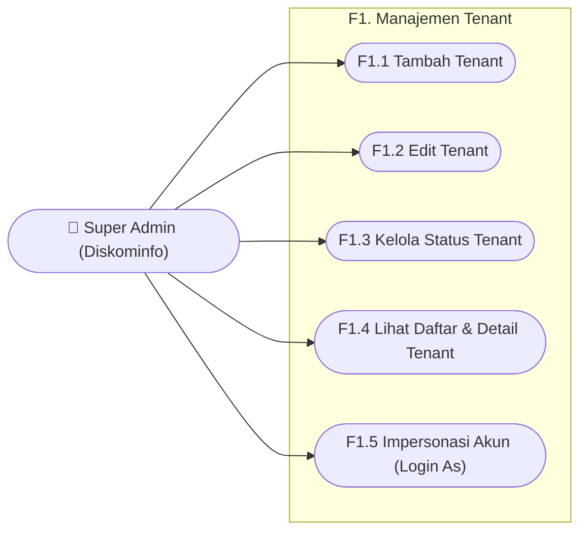
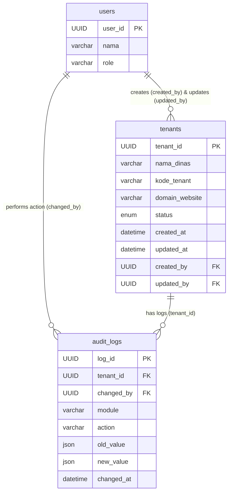

1\. Use Case Diagram: Modul F1. Manajemen Tenant  
Diagram ini menggambarkan interaksi tingkat tinggi antara aktor (Super Admin) dengan sistem pada modul Manajemen Tenant.

Penjelasan Alur Use Case:

* F1.1 Tambah Tenant: Super Admin (Diskominfo) mendaftarkan dinas baru agar dapat menggunakan *chatbot* AKSARA.  
* F1.2 Edit Tenant: Super Admin memperbarui informasi operasional *tenant* (seperti nama, deskripsi, logo, dan domain) agar data selalu relevan.  
* F1.3 Kelola Status Tenant: Super Admin mengubah status operasional *tenant* (contoh: dari ACTIVE ke SUSPENDED) beserta alasan perubahannya.  
* F1.4 Lihat Daftar & Detail Tenant: Super Admin mencari, memfilter daftar *tenant*, serta melihat statistik ringkasan performa *tenant* tersebut.  
* F1.5 Impersonasi Akun: Super Admin beralih peran untuk masuk ke dalam *dashboard* Admin Dinas tertentu guna melakukan pemeliharaan atau pengecekan sistem.

2\. Tabel yang Terlibat dalam Keseluruhan Modul F1  
Modul ini berpusat pada tabel utama tenants beserta tabel pendukungnya.  
A. Tabel tenants (Tabel Utama)  
Menyimpan informasi inti dari setiap instansi/dinas yang terdaftar.

* tenant\_id (UUID, Primary Key)  
* nama\_dinas (Varchar)  
* kode\_tenant (Varchar, Unique)  
* deskripsi (Text)  
* logo\_url (Varchar)  
* domain\_website (Varchar, Unique)  
* status (Enum: PENDING, ACTIVE, SUSPENDED, ARCHIVED)  
* created\_at (Datetime)  
* created\_by (UUID, Foreign Key ke users)  
* updated\_at (Datetime)  
* updated\_by (UUID, Foreign Key ke users)

B. Tabel audit\_logs (Tabel Riwayat/Log)  
Merekam setiap kejadian, perubahan, dan aktivitas impersonasi di dalam sistem.

* log\_id (UUID, Primary Key)  
* tenant\_id (UUID, Foreign Key ke tenants)  
* module (Varchar)  
* action (Varchar)  
* old\_value (JSON)  
* new\_value (JSON)  
* changed\_by / actor\_id (UUID, Foreign Key ke users)  
* changed\_at (Datetime)

C. Tabel users (Tabel Aktor)  
Tabel ini hanya bertindak sebagai tabel relasi (*Foreign Key*) untuk melacak atribut created\_by dan updated\_by pada tabel tenants, serta atribut actor\_id pada audit\_logs. Rincian struktur tabel users akan dibahas lebih lanjut pada modul F2 (Manajemen Admin Dinas).  
*(Catatan: Pada fitur F1.4 Detail Tenant, sistem juga akan membaca tabel *documents*, *widgets*, dan *conversations* murni hanya untuk keperluan kalkulasi agregasi/statistik, bukan untuk dimanipulasi).*  
3\. Entity Relationship Diagram (ERD) & Penjelasannya  
Berikut adalah relasi data yang menunjukkan bagaimana tabel-tabel di atas saling terikat pada modul Manajemen Tenant. 

Penjelasan Alur Relasi (ERD):

1. Relasi users dengan tenants (One-to-Many):  
   * Satu akun users (Super Admin) dapat membuat (create) banyak tenants. Relasi ini disimpan pada atribut created\_by.  
   * Satu akun users (Super Admin) dapat memperbarui (update) banyak tenants (misal saat melakukan Edit atau Ubah Status). Relasi ini disimpan pada atribut updated\_by.  
2. Relasi ganda ke audit\_logs (IT Governance yang Kuat):  
   * Dari sisi users (One-to-Many): Satu Super Admin dapat melakukan banyak aktivitas di sistem (mulai dari menambah *tenant*, mengedit, hingga melakukan impersonasi akun) yang menghasilkan banyak rekaman log. Hubungan ini diikat oleh atribut changed\_by atau actor\_id.  
   * Dari sisi tenants (One-to-Many): Satu dinas (tenants) akan memiliki banyak catatan historis mengenai apa saja yang pernah terjadi di dalam ruang lingkupnya. Hubungan ini diikat oleh atribut tenant\_id pada tabel log.

