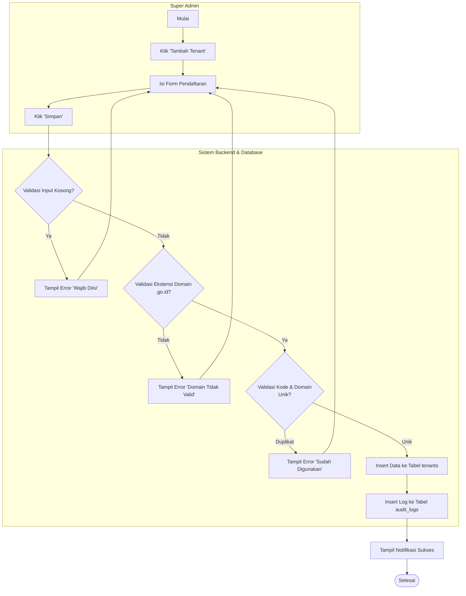
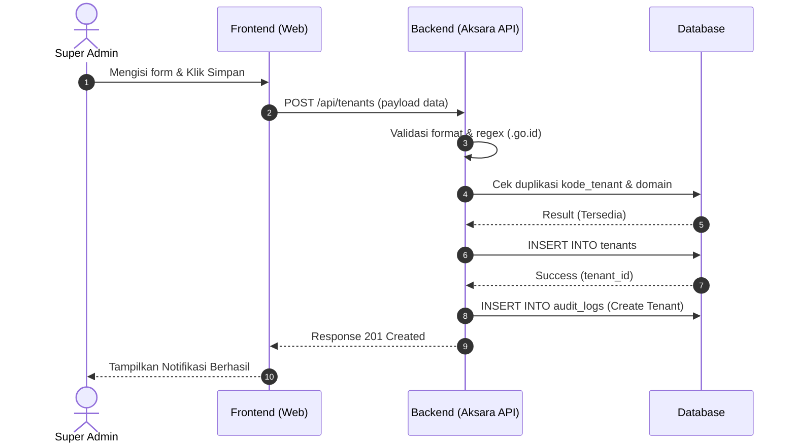

1\. Fitur  
Nama Fitur: Tambah tenant (F1. Manajemen Tenant/Dinas).  
Aktor: Super Admin (Diskominfo).  
Tujuan: Mendaftarkan dinas baru agar dapat menggunakan chatbot AKSARA.

2\. Form Input  
Saat aktor mengklik "Tambah Tenant", Halaman Form Tambah Tenant akan muncul dengan field antarmuka (UI) berikut:

Nama Dinas: Text.  
Kode Tenant: Text.  
Deskripsi: Textarea.  
Logo Dinas: Upload.  
Domain Website: Text.  
Status: Dropdown.

3\. Business Rule  
Aturan bisnis pada fitur ini dibagi menjadi beberapa bagian utama: validasi saat menyimpan, keamanan domain, pengelolaan status, dan aturan umum sistem.

A. Validasi Sistem Saat Menyimpan  
Setelah klik simpan, sistem melakukan validasi berikut:

Validasi 1: Nama dinas wajib diisi. Jika kosong, muncul pesan "Nama dinas harus diisi".  
Validasi 2: Kode tenant harus unik. Misal: jika \`dinkes\` sudah ada, maka muncul pesan "Kode tenant sudah digunakan".  
Validasi 3: Domain tidak boleh duplikat, karena widget chatbot nanti menggunakan domain tersebut.

Jika validasi berhasil, sistem membuat data tenant baru.

B. Validasi Domain Website

Validasi Input (Saat Pendaftaran): Ketika Super Admin mengisi form, sistem (melalui Frontend dan Backend) mengecek format teks menggunakan Regular Expression (Regex) agar field "Domain Web Dinas" hanya menyimpan data yang diakhiri dengan \`.go.id\` atau lebih spesifik \`.ponorogo.go.id\`. Jika menginput \`dispendukcapil.com\` atau \`dinkes.net\`, sistem menolak dengan pesan error: "Domain tidak valid, wajib menggunakan ekstensi resmi pemerintah".

Validasi Keamanan Lanjutan (CORS): Saat widget sudah live, Backend API Aksara menggunakan mekanisme Cross-Origin Resource Sharing (CORS). Saat masyarakat membuka web dinas (misal: \`\[https://dinkes.ponorogo.go.id\](https://dinkes.ponorogo.go.id)\`) dan mengirim pesan, browser mengirim parameter \`Origin\` ke API Aksara. API mengecek apakah domain tersebut terdaftar di tabel \`tenants\`. Jika terdaftar (whitelisted), API merespons; jika script dijalankan di web tidak sah (misal: \`\[http://domain-hacker.com\](http://domain-hacker.com)\`), API memblokir aksesnya (CORS Error).

Validasi Pasangan Kunci (Binding): Sistem melakukan pengecekan ganda (double check) pada setiap request dari widget yang membawa \`widget\_key\` unik. Sistem memvalidasi apakah kunci (misal: \`A1B2C3\`) benar-benar milik domain web dinas tersebut (misal: \`dinkes.ponorogo.go.id\`). Jika kunci milik Dinas Pertanian dipakai di web Dinas Kesehatan, request dibatalkan agar RAG tidak salah merangkum dokumen.

C. Aturan Status Tenant & Hak Akses  
Status ACTIVE (Tenant aktif digunakan):  
Kondisi: Tenant telah memenuhi seluruh syarat operasional.  
Hak Akses Super Admin: Monitoring tenant, suspend tenant, archive tenant.  
Hak Akses Admin Dinas: Kelola knowledge base, kelola chatbot, kelola widget, lihat analytics.  
Hak Akses Guest: Bertanya ke chatbot, memberi feedback, melihat riwayat percakapan.  
Dampak: Widget chatbot dapat digunakan pada website dinas.

Status SUSPENDED (Dinonaktifkan sementara):  
Kondisi: Dilakukan oleh Super Admin jika terjadi penyalahgunaan sistem, dokumen bermasalah, permintaan penghentian sementara dari dinas, atau pemeliharaan sistem. Bisa berubah kembali ke Active ketika masalah selesai.  
Hak Akses Super Admin: Tetap dapat mengelola tenant.  
Hak Akses Admin Dinas: Dapat login, memperbaiki konfigurasi, dan mengunggah dokumen baru.  
Hak Akses Guest: Tidak dapat menggunakan chatbot.  
Dampak: Saat widget diakses, muncul teks "Layanan chatbot sedang tidak tersedia. Silakan coba kembali nanti.".

Status ARCHIVED (Sudah tidak digunakan):  
Kondisi: Tenant tidak lagi digunakan (contoh: dinas digabung, layanan dihentikan permanen, atau tenant sudah tidak diperlukan).  
Hak Akses Super Admin: Hanya dapat melihat data historis.  
Hak Akses Admin Dinas: Tidak dapat login.  
Hak Akses Guest: Tidak dapat mengakses chatbot.  
Dampak: Widget dinonaktifkan permanen, tidak dapat membuat percakapan baru, namun data tetap tersimpan untuk audit.

D. Ketentuan Bisnis (BR)

BR-01: Tenant yang berstatus Pending tidak dapat menerima pertanyaan dari masyarakat.  
BR-02: Tenant hanya dapat berubah menjadi Active jika memiliki minimal satu Admin Dinas, satu Knowledge Base aktif, dan satu Widget aktif.  
BR-03: Tenant yang berstatus Suspended tidak dapat melayani percakapan baru, namun data tetap tersimpan.  
BR-04: Tenant yang berstatus Archived tidak dapat diubah oleh Admin Dinas dan hanya dapat diakses untuk keperluan audit oleh Super Admin.  
BR-05: Semua perubahan status tenant harus dicatat dalam log aktivitas sistem (audit trail) karena sistem digunakan di lingkungan pemerintahan.

4\. Database Table  
Data tenant akan disimpan ke dalam tabel \`tenants\` dengan rincian field berikut:

tenant\_id: UUID.  
nama\_dinas: varchar.  
kode\_tenant: varchar.  
deskripsi: text.  
logo\_url: varchar.  
domain\_website: varchar.  
status: enum.  
created\_at: datetime.  
created\_by: UUID.

5\. Alur Sistem  
Berikut adalah tahapan alur proses penambahan tenant:  
Super Admin \-\> Tambah tenants dan admin tenant \-\> Klik Simpan \-\> Validasi \-\> Insert ke tenants \-\> Insert ke audit\_logs \-\> Selesai.

6\. Activity Diagram  

7\. Sequence Diagram  

