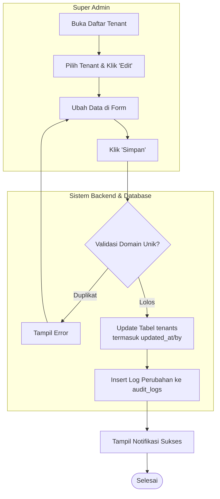
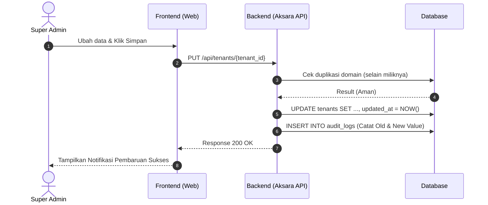

1\. Fitur

* Nama Fitur: Edit tenant.  
* Aktor: Super Admin (Diskominfo).  
* Tujuan: Memperbarui informasi *tenant* yang telah terdaftar agar data *tenant* tetap sesuai dengan kondisi dan kebutuhan dinas.

2\. Form Input  
Saat aktor melakukan Klik "Edit Tenant", maka Halaman Form Edit Tenant Muncul. Form ini terdiri dari *field* berikut:

* Nama Dinas: Menggunakan tipe input Text.  
* Deskripsi: Menggunakan tipe input Textarea.  
* Logo Dinas: Menggunakan tipe input Upload.  
* Domain Website: Menggunakan tipe input Text.

3\. Business Rule  
Berikut adalah ketentuan bisnis yang berlaku pada fitur ini:

* BR-01: Hanya Super Admin yang dapat mengubah data *tenant*.  
* BR-02: Tenant harus sudah terdaftar sebelum dapat diubah.  
* BR-03: Domain *website* harus unik di dalam sistem.  
* BR-04: Perubahan data *tenant* harus dicatat dalam *audit trail*.  
* BR-05: Perubahan logo *tenant* akan menggantikan logo sebelumnya.  
* BR-06: Tenant yang berstatus *Archived* tidak dapat dilakukan perubahan data operasional dan hanya dapat diakses untuk kebutuhan audit.

4\. Database Table  
Proses pengeditan ini melibatkan pembaruan dan pencatatan pada tabel berikut:

* Tabel Tenants: Sistem memperbarui data *tenant*, memperbarui *field* updated\_at dan updated\_by, kemudian menyimpan perubahan tersebut ke *database*.  
* Tabel Audit Logs (Audit Log): Setiap perubahan data *tenant* akan dicatat ke tabel audit\_logs. Data yang dicatat meliputi: tenant\_id, *field* yang diubah, nilai lama, nilai baru, waktu perubahan, dan pengguna yang melakukan perubahan.  
  * Contoh pencatatan audit log: Tenant: Dinas Kesehatan , Field: domain\_website , Nilai Lama: dinkes-old.ponorogo.go.id , Nilai Baru: dinkes.ponorogo.go.id , Diubah Oleh: Super Admin XXX , Waktu: 2026-06-24 10:15:00.

5\. Alur Sistem  
Berikut adalah urutan alur edit *tenant*:

1. Super Admin.  
2. Pilih Tenant.  
3. Klik Edit Tenant.  
4. Form Edit Tenant Muncul.  
5. Ubah Data.  
6. Klik Simpan.  
7. Validasi Domain.  
8. Update Tabel tenants.  
9. Update updated\_at.  
10. Update updated\_by.  
11. Insert Audit Log.  
12. Data Berhasil Disimpan.

6\. Activity Diagram 

7\. Sequence Diagram

