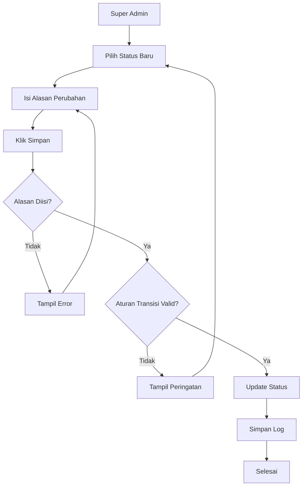
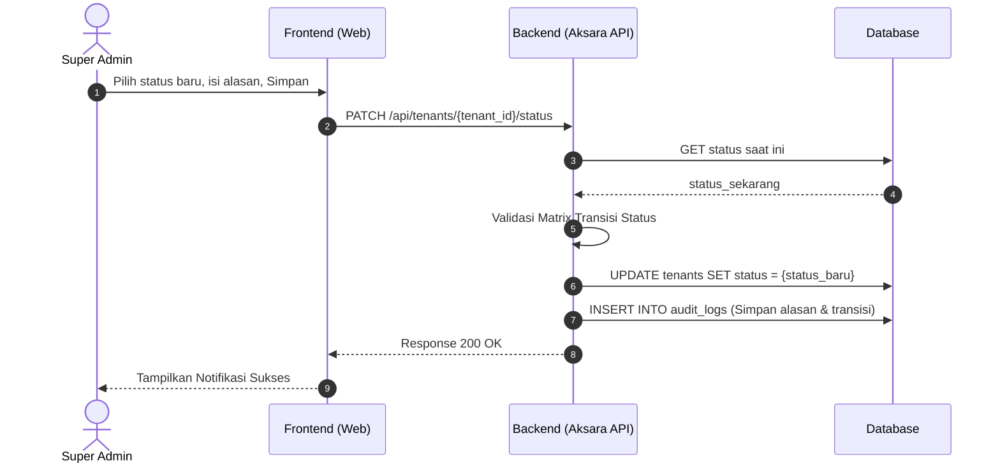

1\. Fitur

* Nama Fitur: Mengubah status tenant.  
* Aktor & Aksi Utama: Super Admin memilih *tenant* dari daftar *tenant*, kemudian klik tombol \[Kelola Status Tenant\].

2\. Form Input  
Pada antarmuka (UI) pengelolaan status, terdapat *field* dengan tipe input sebagai berikut:

* Nama Dinas: Read Only.  
* Kode Tenant: Read Only.  
* Status Saat Ini: Read Only.  
* Status Baru: Dropdown.  
* Alasan Perubahan: Textarea.

3\. Business Rule  
Berikut adalah ketentuan bisnis dan validasi yang berlaku pada fitur ini:  
A. Aturan Transisi Status (Validasi 3\)

* Perubahan status harus mengikuti aturan transisi yang valid.  
* Transisi yang Diizinkan: Active → Suspended, Suspended → Active, Suspended → Archived.  
* Transisi yang Tidak Diizinkan: Archived → Active, Archived → Suspended.

B. Validasi Form Input

* Validasi 1: Status Baru wajib dipilih. Jika kosong, sistem akan menampilkan pesan: "Status baru harus dipilih.".  
* Validasi 2: Alasan perubahan wajib diisi. Jika kosong, sistem akan menampilkan pesan: "Alasan perubahan status harus diisi.".

C. Ketentuan Bisnis (BR)

* BR-01: Hanya Super Admin yang dapat mengubah status *tenant*.  
* BR-02: Tenant yang berstatus Active dapat diubah menjadi Suspended apabila terjadi pemeliharaan sistem, penyalahgunaan layanan, atau alasan operasional lainnya.  
* BR-03: Tenant yang berstatus Suspended tidak dapat melayani percakapan baru tetapi data tetap tersimpan.  
* BR-04: Tenant yang berstatus Suspended dapat diaktifkan kembali menjadi Active setelah masalah diselesaikan.  
* BR-05: Tenant yang berstatus Suspended dapat diubah menjadi Archived apabila sudah tidak digunakan lagi.  
* BR-06: Tenant yang berstatus Archived tidak dapat digunakan oleh Admin Dinas maupun masyarakat.  
* BR-07: Setiap perubahan status *tenant* wajib dicatat ke dalam *audit trail*.  
* BR-08: Alasan perubahan status wajib disimpan pada *audit log*.

4\. Database Table  
Proses ini melibatkan pembaruan dan pencatatan pada tabel-tabel berikut:  
Tabel tenant yang terlibat:

* tenant\_id: Tipe UUID.  
* nama\_dinas: Tipe varchar.  
* kode\_tenant: Tipe varchar.  
* status: Tipe enum.  
* updated\_at: Tipe datetime.  
* updated\_by: Tipe UUID.

Tabel pencatatan log (Audit Log):

* log\_id: Tipe UUID.  
* tenant\_id: Tipe UUID.  
* module: Tipe varchar.  
* action: Tipe varchar.  
* old\_value: Tipe json.  
* new\_value: Tipe json.  
* changed\_by: Tipe UUID.  
* changed\_at: Tipe datetime.

5\. Alur Sistem  
Alur transisi atau siklus perubahan status *tenant* di dalam sistem berjalan dengan urutan sebagai berikut:

* CREATE → ACTIVE → SUSPENDED → ACTIVE → ARCHIVED.

6\. Activity Diagram  

7\. Sequence Diagram

