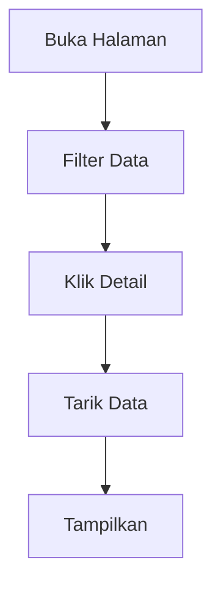
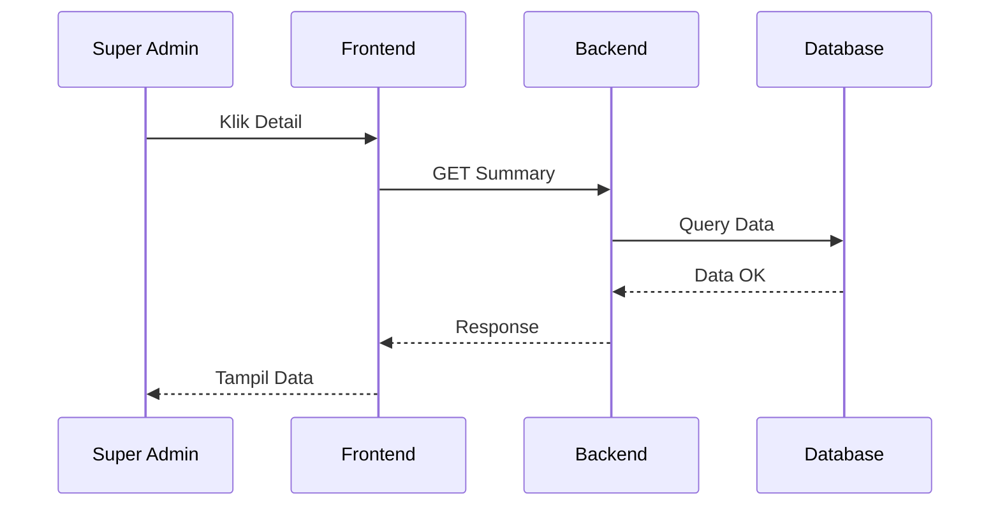

1\. Fitur

* Nama Fitur: Lihat Daftar dan Detail Tenant.  
* Deskripsi: Fitur yang memungkinkan pengguna untuk mencari, memfilter, melihat daftar *tenant*, serta melihat detail informasi dan statistik ringkasan dari suatu *tenant*.

2\. Form Input  
Pada antarmuka pengguna (UI), terdapat beberapa elemen untuk input dan tampilan data:  
A. UI Filter Pencarian

* Nama Dinas: Tipe input Search Text.  
* Kode Tenant: Tipe input Search Text.  
* Status: Tipe input Dropdown.  
* Tanggal Pembuatan: Tipe input Date Range.

B. Tabel Daftar Tenant

* Tabel ini menampilkan kolom: Nama Dinas, Kode Tenant, Status, Domain, Dibuat Pada, dan Aksi.  
* Contoh data yang ditampilkan:  
  * Dinas Kesehatan | dinkes | Active | dinkes.ponorogo.go.id | 20/06/2026.  
  * Dinas Pendidikan | disdik | Pending | disdik.ponorogo.go.id | 24/06/2026.  
* Pada kolom Aksi, terdapat tombol: \[Detail\], \[Edit\], dan \[Kelola Status\].

C. Halaman Detail Tenant  
Halaman ini menyajikan informasi lengkap yang terbagi menjadi dua bagian:

1. Informasi Tenant: Menampilkan Nama Dinas (contoh: Dinas Kesehatan), Kode Tenant (contoh: dinkes), Domain Website (contoh: dinkes.ponorogo.go.id), Status (contoh: Active), Dibuat Oleh (contoh: Super Admin), dan Dibuat Pada (contoh: 24-06-2026).  
2. Ringkasan Tenant: Menampilkan Jumlah Admin Dinas (contoh: 3), Jumlah Dokumen (contoh: 25), Jumlah Widget (contoh: 1), Total Percakapan (contoh: 5.230), dan Feedback Positif (contoh: 92%).

3\. Business Rule  
Berikut adalah ketentuan bisnis dan logika yang berlaku pada sistem:

* BR-01: Hanya Super Admin yang dapat melihat seluruh *tenant*.  
* BR-02: Data *tenant* dapat dicari berdasarkan nama dinas.  
* BR-03: Data *tenant* dapat difilter berdasarkan status.  
* BR-04: Tenant yang berstatus Archived tetap ditampilkan untuk kebutuhan audit.  
* BR-05: Data *tenant* harus ditampilkan sesuai *tenant* yang tersimpan pada *database*.  
* BR-06: Informasi statistik *tenant* ditampilkan berdasarkan data aktual pada sistem.  
* Logika Kalkulasi (Rumus): Nilai pada Feedback Positif dihitung menggunakan rumus: jumlah positive / total feedback \* 100%.

4\. Database Table  
Untuk menampilkan seluruh informasi dan statistik tersebut, sistem melibatkan tabel-tabel berikut:

* Tabel tenants: Menyimpan informasi utama *tenant* dengan *field* tenant\_id (UUID), nama\_dinas (varchar), kode\_tenant (varchar), domain\_website (varchar), status (enum), created\_at (datetime), dan created\_by (UUID).  
* Tabel users: Digunakan untuk menampilkan jumlah Admin Dinas.  
* Tabel documents: Digunakan untuk menampilkan jumlah *knowledge base*.  
* Tabel widgets: Digunakan untuk menampilkan *widget tenant*.  
* Tabel conversations: Digunakan untuk menampilkan statistik penggunaan *chatbot*.

5\. Alur Sistem

1. Super Admin dapat menggunakan Form UI Filter Pencarian untuk mencari atau menyaring data *tenant* yang tampil pada Tabel Daftar Tenant.  
2. Saat Super Admin melakukan "Klik Detail" pada salah satu baris di tabel, sistem akan merespons dengan menampilkan informasi *tenant* secara lengkap.  
3. Sistem kemudian memuat Halaman Detail Tenant, menarik data primer dari tabel tenants, serta menghitung agregasi data dari tabel users, documents, widgets, dan conversations untuk menyajikan Ringkasan Tenant.

6\. Activity Diagram 

7\. Sequence Diagram  

