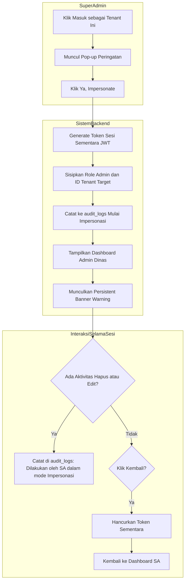
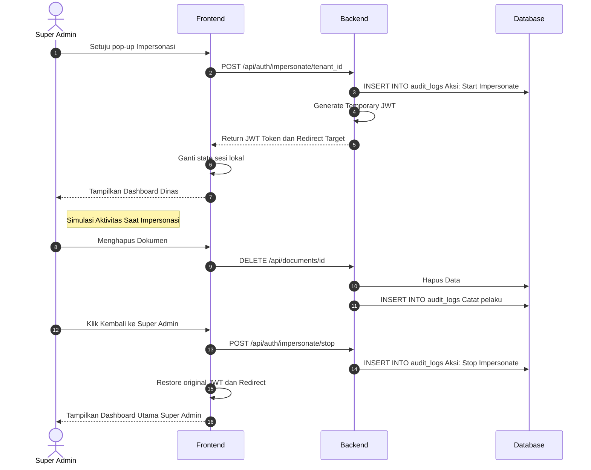

1\. Fitur

Impersonasi Akun Admin Dinas (Login As) & Pencatatan Audit Log Fitur yang memungkinkan Super Admin di Diskominfo untuk sementara beralih peran masuk ke dalam *dashboard* Admin Dinas tertentu. Semua aktivitas (klik, tambah, hapus) yang dilakukan selama masa impersonasi akan dicatat ke dalam sistem log keamanan.

2\. Form Input & Antarmuka (UI/UX)

Tidak ada form isian teks untuk fitur ini, melainkan alur interaksi antarmuka:

* Tombol Aksi (Action Button): Pada tabel daftar *Tenant*, terdapat tombol aksi ekstra bernama "Masuk sebagai Tenant Ini" atau ikon *mata/topeng*.  
* Modal Konfirmasi (Warning Pop-up): Saat tombol ditekan, muncul kotak peringatan: *"Anda akan masuk ke dalam sesi Dinas Kesehatan. Segala aktivitas Anda akan terekam dalam Audit Log. Lanjutkan?"* beserta tombol \[Ya, Impersonate\].  
* Persistent Banner (Pita Notifikasi Aktif): Selama Super Admin berada di dalam *dashboard* Dinas Kesehatan, harus ada pita berwarna mencolok (misal: merah atau kuning) yang melayang di bagian paling atas layar bertuliskan: *"Anda sedang berada dalam mode Impersonasi sebagai Dinas Kesehatan."* beserta tombol \[Kembali ke Super Admin\].

3\. Business Rule (Aturan Sistem)

1. Manipulasi Sesi (Session Token): Saat impersonasi disetujui, *backend* akan menerbitkan token sesi (JWT) sementara yang berisi identitas gabungan: role \= admin, tenant\_id \= ID\_Dinkes, namun tetap menyimpan original\_user\_id \= ID\_SuperAdmin.  
2. Pencatatan Awal (Log Entry): Begitu Super Admin berhasil masuk ke *dashboard* dinas, sistem otomatis mencatat di tabel log bahwa Super Admin "A" memulai impersonasi ke Tenant "B" pada jam tertentu.  
3. Pelacakan Aktivitas Menyeluruh (Audit Trail): Jika Super Admin (dalam mode impersonasi) melakukan aksi seperti menghapus dokumen PDF dari *knowledge base* Dinas Kesehatan, sistem tidak akan mencatat bahwa "Admin Dinas Kesehatan yang menghapusnya", melainkan mencatat: *"Dokumen dihapus oleh Super Admin 'A' yang sedang meng-impersonasi Dinas Kesehatan"*.  
4. Terminasi Otomatis & Manual: Sesi impersonasi akan berakhir jika Super Admin menekan tombol \[Kembali\] di *banner* atas, atau secara otomatis berakhir jika diam (*idle*) selama batas waktu tertentu (misal 15 menit) demi keamanan.

4\. Database Table (Tabel Relevan)

Untuk mendukung pelacakan ini, kita membutuhkan satu tabel baru khusus untuk merekam jejak, yaitu audit\_logs.

5\. ERD (Entity Relationship Diagram)

Logika relasi pelacakan antara pelakunya, korbannya (tenant), dan catatannya.

users (1) \--------------------- (M) audit\_logs tenants (1) \------------------- (M) audit\_logs

* Jenis Relasi: *One-to-Many* (Satu-ke-Banyak) ganda.  
* Penjelasan:  
  * Satu users (Super Admin) dapat melakukan banyak aktivitas yang menghasilkan banyak rekaman di tabel audit\_logs. Hubungan ini diikat oleh atribut actor\_id.  
  * Satu tenants (Dinas) dapat memiliki banyak catatan aktivitas di dalam audit\_logs yang terjadi di dalam wilayahnya. Hubungan ini diikat oleh atribut tenant\_id.

Desain ini sangat kuat secara tata kelola IT (*IT Governance*). Selain berguna untuk menelusuri *bug* aplikasi, catatan *audit log* ini menjadi bukti valid apabila di kemudian hari terjadi sengketa data (misalnya Admin Dinas protes kenapa dokumen mereka tiba-tiba hilang, sistem bisa membuktikan siapa yang menghapusnya secara presisi).

6\. Activity Diagram

7\. Sequence Diagram

