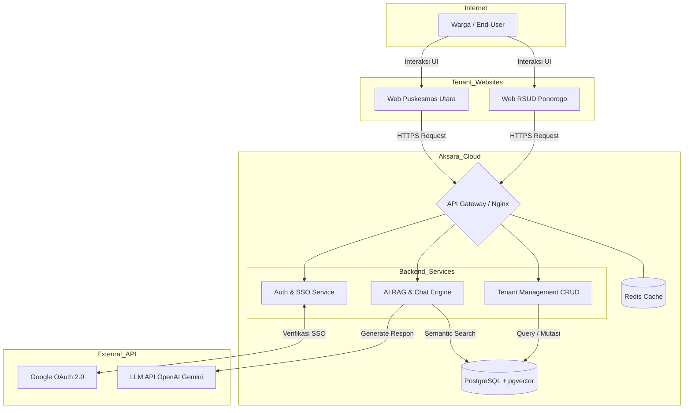
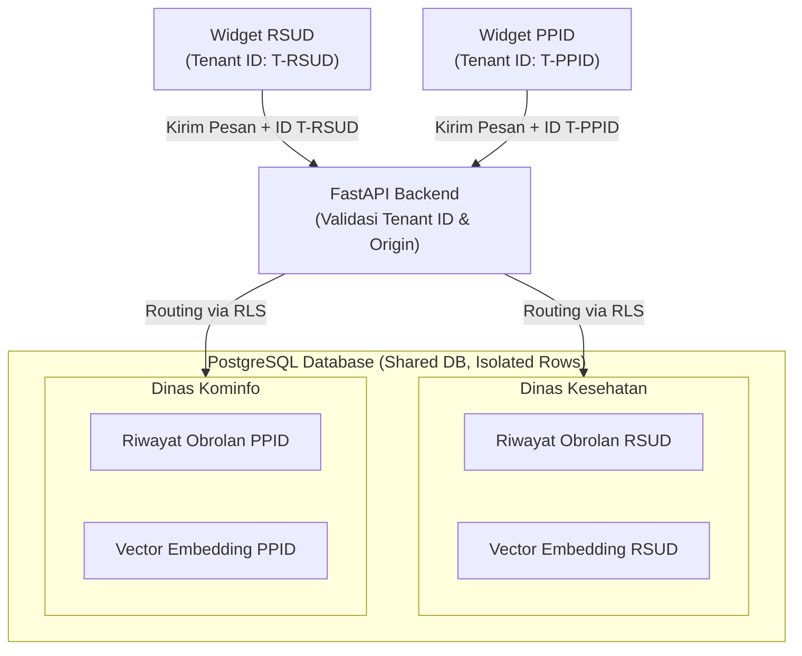

Markdown
# Aksara Multi-Tenant Platform — Arsitektur Sistem

## Gambaran Besar (High-Level Architecture)

Arsitektur Aksara memisahkan secara logis antara *Back-Office* (Dasbor Super Admin & Dinas) dengan *Public Facing Widget* (yang diakses warga), menggunakan arsitektur layanan mikro (*micro-services*) yang ringan.


    
### Arsitektur Multi-Tenant (Isolasi Data)
Isolasi data adalah kunci dari platform ini. Data operasional, riwayat obrolan, dan dokumen Knowledge Base antar-Dinas dipisahkan secara ketat menggunakan metode Row-Level Security (RLS) di dalam basis data PostgreSQL.



Setiap request (permintaan) dari widget publik wajib menyertakan Tenant ID. Backend akan memvalidasi apakah domain website asal (Origin) cocok dengan Tenant ID yang terdaftar untuk mencegah widget hijacking (pembajakan widget ke website tidak resmi).

### Alur Data Detail: Proses Tanya Jawab (Chat & RAG Flow)
Berikut adalah urutan logika (sequence) dari saat warga mengirim pesan hingga AI membalas, memanfaatkan mekanisme Retrieval-Augmented Generation (RAG) untuk memastikan AI menjawab dari dokumen SOP instansi, bukan berhalusinasi.

```mermaid
sequenceDiagram
    participant W as Warga (Widget)
    participant A as FastAPI Backend
    participant V as pgvector (Knowledge Base)
    participant L as LLM Engine (OpenAI/Gemini)

    W->>A: 1. Kirim pesan ("Jam buka poli gigi?") + SSO Token + Tenant ID
    
    rect rgb(30, 30, 30)
        Note over A, V: Fase Pengambilan Konteks (Retrieval)
        A->>A: 2. Validasi Token, Rate Limit (Redis), & Tenant
        A->>A: 3. Ubah pesan warga menjadi Vector Embedding
        A->>V: 4. Semantic Search (Cari kemiripan vektor khusus Tenant ID terkait)
        V-->>A: 5. Kembalikan cuplikan teks SOP yang relevan
    end

    rect rgb(30, 30, 40)
        Note over A, L: Fase Pembuatan Jawaban (Generation)
        A->>A: 6. Susun Prompt (Pesan Warga + Cuplikan SOP)
        A->>L: 7. Kirim System Prompt ke LLM
        L-->>A: 8. Kembalikan jawaban natural (Stream)
    end

    A->>A: 9. Simpan riwayat chat ke PostgreSQL
    A-->>W: 10. Tampilkan balasan di Widget Aksara
```



### Alur Otentikasi Warga (Anti-Spam)
Aksara menggunakan mekanisme Google SSO pada Pre-Chat Form untuk memastikan data warga valid, mencegah eksploitasi bot, dan menjaga kualitas basis data.

```text
Warga buka Widget Aksara
│
├── Tampilkan Pre-Chat Form (Tombol "Login dengan Google")
│   │
│   ├── Warga klik tombol SSO.
│   ├── Popup Google OAuth muncul → Warga memilih akun email.
│   ├── Google mengembalikan "Authorization Code" ke Frontend Widget.
│   ├── Frontend mengirim Code ke FastAPI Backend.
│   ├── Backend melakukan validasi Code ke server Google.
│   ├── Backend mencatat/memperbarui profil dasar warga (Email/Nama) ke Database.
│   └── Backend menerbitkan Session Token sementara (hanya berlaku untuk sesi aktif saat ini).
│
└── Masuk ke layar obrolan utama (Chat Screen)