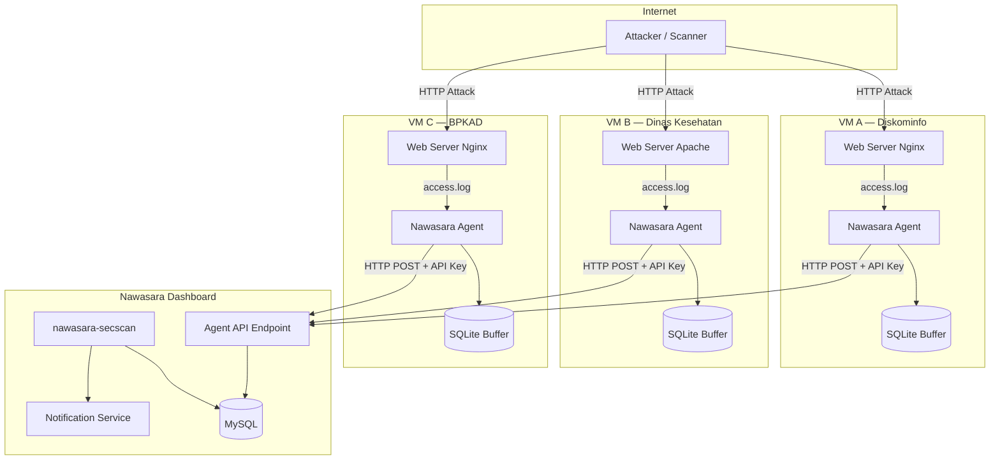
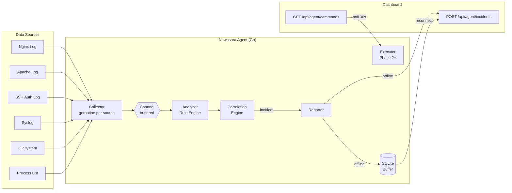
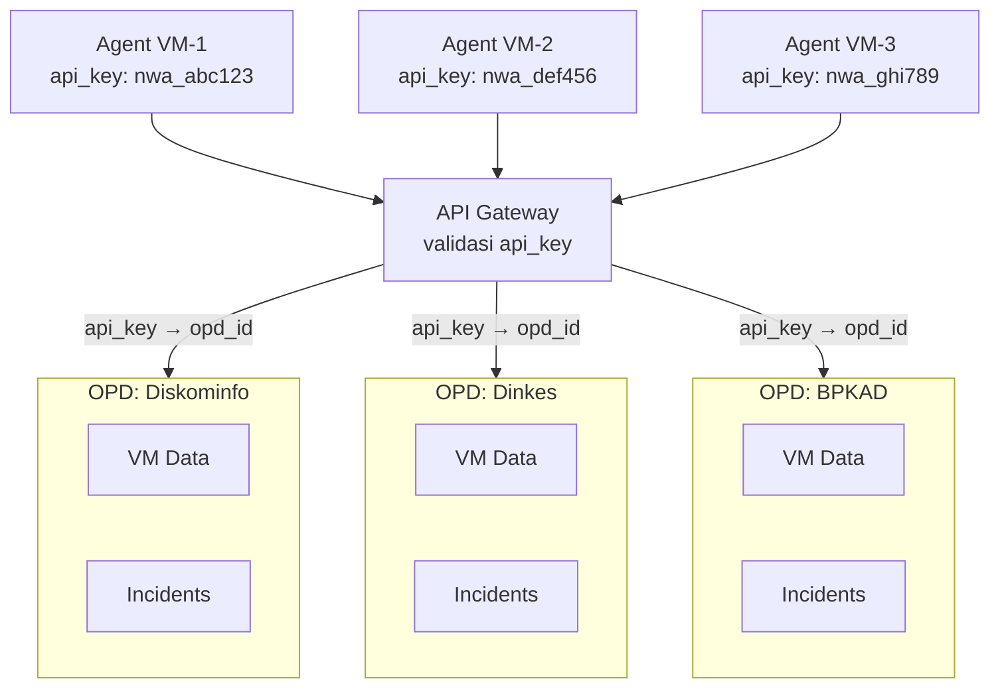

# Nawasara Agent — Arsitektur Sistem

## Gambaran Besar



---

## Arsitektur Internal Agent



---

## Flow Data Detail

### 1. Collector → Analyzer

```
/var/log/nginx/access.log
│
│  (tail -f, realtime inotify)
▼
Collector goroutine
│
│  parse line → LogEntry struct
│  {
│    timestamp: "2026-06-30T10:00:01Z"
│    source_ip: "185.220.101.45"
│    method: "GET"
│    path: "/.env"
│    status: 404
│    user_agent: "python-requests/2.28"
│  }
▼
buffered channel (cap: 10000)
▼
Analyzer
```

### 2. Analyzer → Incident

```
LogEntry masuk Analyzer
│
├── Match rule: path == "/.env"       → score += 10
├── Match rule: path == "/.git"       → score += 10
├── Match rule: UA contains "python"  → score += 5
│
├── score = 25 >= threshold (20)
│
▼
Incident{
  type:       "vulnerability_scan"
  severity:   "high"
  source_ip:  "185.220.101.45"
  score:      25
  evidence:   ["GET /.env 404", "GET /.git 404"]
  detected_at: "2026-06-30T10:00:03Z"
}
```

### 3. Correlation Engine

```
Event 1: GET /.env         (score 10)
Event 2: GET /.git         (score 10)
Event 3: GET /wp-admin     (score 5)
Event 4: POST /login × 15  (score 20)
Event 5: HTTP 500          (score 5)

Time window: 2 menit
Source IP: sama

─────────────────────────────────
Correlation: POSSIBLE EXPLOIT CHAIN

Daripada 5 incident terpisah → 1 incident:

{
  type:     "exploit_chain"
  severity: "critical"
  phases:   ["recon", "brute_force", "exploitation"]
  score:    50
}
```

### 4. Reporter → Dashboard

```
Incident ready
│
├── [online]  → HTTP POST ke Dashboard
│               Authorization: Bearer {api_key}
│               Content-Type: application/json
│               body: { incident payload }
│
└── [offline] → simpan ke SQLite lokal
                tabel: pending_incidents
                retry: setiap 30 detik
                max_age: 7 hari
```

---

## Multi-Tenant Architecture



Setiap `api_key` terikat ke satu `agent` record di Database.
Agent record terikat ke `opd_id` (via nawasara-registry).
Isolasi data otomatis — OPD A tidak bisa lihat incident OPD B.

---

## OS Adaptability

```mermaid
graph TD
    START[Agent Start]
    DETECT[Detect OS]

    subgraph Ubuntu_Debian["Ubuntu / Debian"]
        UB_LOG[/var/log/nginx/access.log]
        UB_SSH[/var/log/auth.log]
        UB_SVC[systemctl]
    end

    subgraph CentOS_RHEL["CentOS / RHEL / AlmaLinux"]
        RH_LOG[/var/log/nginx/access.log]
        RH_SSH[/var/log/secure]
        RH_SVC[systemctl]
        RH_FW[firewall-cmd]
    end

    subgraph Config["Runtime Config"]
        CFG[log_paths\nservice_manager\nfirewall_cmd\npackage_manager]
    end

    START --> DETECT
    DETECT -->|/etc/debian_version| Ubuntu_Debian
    DETECT -->|/etc/redhat-release| CentOS_RHEL
    Ubuntu_Debian --> CFG
    CentOS_RHEL --> CFG
```

---

## Auto-Update Flow

```
Agent jalan
│
├── setiap 6 jam: GET /api/agent/version
│   response: { "latest": "1.2.0", "current": "1.1.0" }
│
├── versi baru tersedia?
│   ├── download binary dari /api/agent/download/linux-amd64/1.2.0
│   ├── verify SHA256 checksum
│   ├── simpan sebagai /usr/local/bin/nawasara-agent.new
│   ├── systemctl stop nawasara-agent
│   ├── mv nawasara-agent.new nawasara-agent
│   └── systemctl start nawasara-agent
│
└── versi sama → skip
```

---

## Offline Resilience

```
Normal:
Agent → [HTTP POST] → Dashboard ✓

Dashboard down:
Agent → [HTTP POST] → GAGAL
Agent → simpan ke SQLite (pending_incidents)

Dashboard kembali online:
Agent → retry worker (setiap 30 detik)
     → baca pending_incidents ORDER BY created_at
     → kirim satu per satu
     → hapus dari SQLite setelah berhasil
```

Batas penyimpanan lokal: **7 hari** atau **100MB**, mana yang tercapai lebih dulu.
