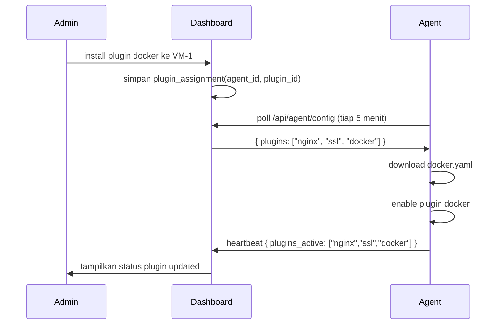

# Nawasara Agent — Plugin System

## Filosofi

Core agent hanya tahu cara: baca log web server + SSH, analisa, kirim.
Semua kemampuan tambahan adalah **plugin** — modul terpisah yang bisa
di-install, diaktifkan, dinonaktifkan, dan dihapus tanpa mengubah binary utama.

VM sederhana (1 vCPU, 512MB) tidak perlu menanggung beban Docker monitor
jika Docker tidak terinstall. Plugin memastikan agent tetap ringan.

---

## Mekanisme Plugin

### Struktur Plugin

```
/etc/nawasara-agent/
├── config.yaml           ← config utama agent
├── plugins/
│   ├── enabled/          ← symlink ke plugin yang aktif
│   │   ├── nginx.yaml -> ../available/nginx.yaml
│   │   └── ssl.yaml -> ../available/ssl.yaml
│   └── available/        ← semua plugin yang terinstall
│       ├── nginx.yaml
│       ├── apache.yaml
│       ├── docker.yaml
│       ├── laravel.yaml
│       ├── ssl.yaml
│       └── cron.yaml
└── rules/                ← rule engine files
    ├── vulnerability-scan.yaml
    ├── sql-injection.yaml
    └── ...
```

### Plugin Format

Setiap plugin adalah file YAML yang mendeskripsikan:
- Sumber data apa yang dibaca
- Rule tambahan yang dibawa plugin itu
- Command yang di-expose ke Executor (Phase 2+)

```yaml
# plugins/available/docker.yaml
id: plugin_docker
name: Docker Monitor
version: "1.0.0"
description: Monitor Docker container health, restarts, and stops
min_agent_version: "1.0.0"

collectors:
  - type: docker_daemon
    socket: /var/run/docker.sock
    interval: 30s

rules:
  - id: docker_container_restart
    name: Container Restart Loop
    conditions:
      source: docker_daemon
      event: restart
      count: 5
      window_seconds: 300
    severity: high
    type: docker_restart_loop

  - id: docker_container_unhealthy
    name: Container Unhealthy
    conditions:
      source: docker_daemon
      event: health_status
      status: unhealthy
    severity: medium
    type: docker_unhealthy

executor_commands:
  - action: restart_container
    description: Restart a Docker container
    params:
      - name: container_name
        type: string
        required: true
```

### CLI Management

```bash
# Lihat plugin yang tersedia
nawasara-agent plugin list

# Install plugin baru (download dari Dashboard)
nawasara-agent plugin install docker
nawasara-agent plugin install laravel
nawasara-agent plugin install ssl

# Aktifkan plugin
nawasara-agent plugin enable docker

# Nonaktifkan plugin (tidak dihapus)
nawasara-agent plugin disable docker

# Hapus plugin
nawasara-agent plugin remove docker

# Status plugin
nawasara-agent plugin status
```

Output `plugin status`:
```
PLUGIN          VERSION   STATUS    COLLECTORS  RULES
nginx           1.2.0     active    2           8
ssl             1.0.0     active    1           2
docker          1.1.0     disabled  0           0
laravel         1.0.0     active    3           5
```

---

## Daftar Plugin

### Plugin Tier 1 — Bundled (terinstall otomatis)

#### `nginx`
Monitor Nginx web server.
- Collector: access log, error log
- Rules: vulnerability scan, SQL injection, XSS, brute force, scanner bot,
  directory traversal, webshell upload, 4xx storm
- Executor: `restart_nginx`, `reload_nginx`

#### `apache`
Monitor Apache web server.
- Collector: access log, error log
- Rules: sama dengan nginx
- Executor: `restart_apache`, `reload_apache`

#### `ssh`
Monitor SSH authentication.
- Collector: `/var/log/auth.log` atau `/var/log/secure`
- Rules: SSH brute force, root login, invalid user flood, new key added
- Events: setiap successful login dicatat (audit trail)

---

### Plugin Tier 2 — Optional Common

#### `docker`
Monitor Docker containers.
- Collector: Docker daemon socket
- Rules: container restart loop, container stopped, unhealthy container,
  container running as root, exposed port baru
- Executor: `restart_container`, `stop_container`

#### `laravel`
Monitor aplikasi Laravel.
- Collector: `storage/logs/laravel.log`, queue status via artisan
- Rules: queue failed job spike, horizon dead, scheduler tidak berjalan,
  APP_DEBUG=true di production, error rate meningkat
- Executor: `artisan_queue_restart`, `artisan_cache_clear`, `artisan_horizon_restart`

#### `ssl`
Monitor SSL certificate expiry.
- Collector: probe HTTPS setiap 6 jam ke domain yang dikonfigurasi
- Rules: SSL expires < 30 hari (warning), < 7 hari (critical), expired, mismatch
- Incidents: terstruktur dengan tanggal expiry, issuer, subject

#### `cron`
Monitor crontab changes.
- Collector: hash `/etc/crontab`, `/etc/cron.d/*`, user crontabs
- Rules: crontab baru ditambahkan, crontab berubah, entry baru dengan curl/wget/bash

#### `php-fpm`
Monitor PHP-FPM.
- Collector: PHP-FPM status endpoint, error log
- Rules: FPM restart berulang, pool penuh (504 storm), error meningkat
- Executor: `restart_php_fpm`

#### `mysql`
Monitor MySQL/MariaDB.
- Collector: error log, slow query log (opsional)
- Rules: koneksi ditolak meningkat, slow query spike, auth failure
- Executor: `restart_mysql`

---

### Plugin Tier 3 — Advanced (Phase 3+)

#### `file-integrity`
Monitor integritas file kritis.
- Collector: inotify watch pada direktori web + file kritis
- Database: hash baseline setiap file (SHA256)
- Rules: file kritis berubah (`.env`, config), file PHP baru di upload dir,
  file executable baru di web root
- Incident: diff hash, nama file, waktu perubahan

#### `file-scanner`
Scan file untuk malware/webshell.
- Collector: scan berkala (default: setiap 6 jam) + scan on-demand
- Database: signature patterns (CVE + webshell patterns)
- Detection: eval+base64, webshell signatures (c99, r57, WSO, b374k),
  PHP backdoor patterns, encoded payload
- Incident: path file, pattern yang match, severity

#### `rootkit-detect`
Deteksi tanda-tanda rootkit.
- Collector: process list, port list, kernel module list
- Rules: proses hidden (ada di /proc tapi tidak di ps), port tersembunyi,
  kernel module tidak dikenal, binary system berubah hash
- Severity: selalu critical

#### `redis`
Monitor Redis.
- Collector: Redis INFO command, slowlog
- Rules: memory hampir penuh, banyak rejected connections, key eviction spike

#### `keycloak`
Monitor Keycloak instance.
- Collector: Keycloak event log via Admin API
- Rules: admin login berhasil dari IP baru, realm config berubah,
  banyak failed login ke realm, user baru dibuat

---

## Plugin Registry di Dashboard



Admin bisa manage plugin semua VM dari satu tempat di Dashboard —
tidak perlu SSH ke setiap VM satu per satu.
