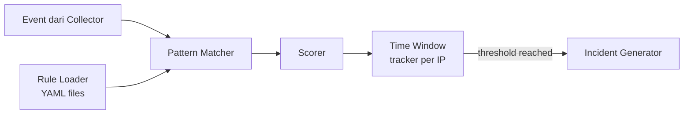
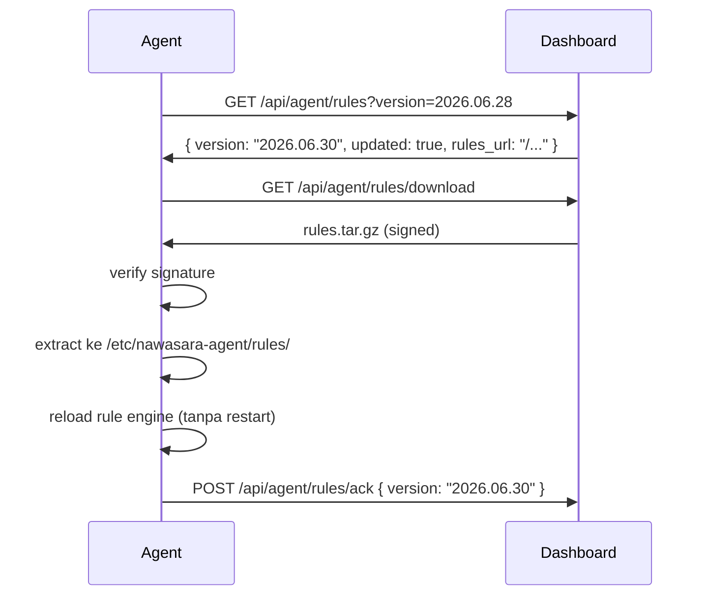

# Nawasara Agent — Rule Engine & CVE Signature Database

## Filosofi

> Seperti antivirus jadul — tidak perlu AI, cukup signature yang kuat dan update.

Rule engine bekerja dengan **pattern matching + scoring**, bukan machine learning.
Sederhana, deterministik, cepat, dan bisa dijelaskan ke admin kenapa suatu request
dianggap berbahaya.

---

## Rule Engine Architecture



---

## Format Rule

### Rule Sederhana (pattern matching)

```yaml
id: rule_vuln_scan_env
name: Dotenv File Access
category: vulnerability_scan
phase: recon
severity: high
score: 10
conditions:
  source: web_log
  match_any:
    path_equals:
      - "/.env"
      - "/.env.bak"
      - "/.env.old"
      - "/.env.example"
      - "/.env.local"
      - "/.env.production"
tags: [recon, dotenv, laravel]
references:
  - CVE-2017-9841
  - "OWASP: Sensitive Data Exposure"
```

### Rule dengan Counter (rate-based)

```yaml
id: rule_brute_force_http
name: HTTP Login Brute Force
category: brute_force
severity: high
score: 5_per_match
threshold: 50
conditions:
  source: web_log
  per_ip: true
  window_seconds: 60
  method: POST
  path_match_any:
    - "/login"
    - "/signin"
    - "/auth/login"
    - "/wp-login.php"
    - "/administrator/index.php"
    - "/admin/login"
```

### Rule dengan Regex

```yaml
id: rule_sqli_url
name: SQL Injection in URL
category: sql_injection
severity: critical
score: 40
conditions:
  source: web_log
  match_any:
    query_regex:
      - "(?i)(UNION.{1,20}SELECT)"
      - "(?i)(OR.{1,5}1.?=.?1)"
      - "(?i)(DROP.{1,10}TABLE)"
      - "(?i)(INSERT.{1,10}INTO)"
      - "(?i)(xp_cmdshell)"
      - "(?i)(EXEC.{1,5}\\()"
      - "(?i)(BENCHMARK.{1,10}\\()"
      - "(?i)(SLEEP.{1,5}\\()"
      - "(?i)('\\s*OR\\s*')"
    path_regex:
      - "(?i)(\\.\\.[\\/]){2,}"   # directory traversal
references:
  - "OWASP A03:2021 Injection"
  - "CWE-89"
```

---

## CVE Signature Database

Database signature disimpan terpisah dari rule engine — bisa di-update tanpa
update binary agent.

### Format Database

```json
{
  "version": "2026.06.30",
  "generated_at": "2026-06-30T00:00:00Z",
  "signatures": [
    {
      "id": "sig_webshell_c99",
      "name": "C99 Webshell",
      "type": "file_content",
      "severity": "critical",
      "tags": ["webshell", "php"],
      "patterns": [
        "c99_buff_prepare",
        "c99shell",
        "FilesMan",
        "BBBBBBBBBBBBBBBBBBBBBBBB"
      ],
      "references": ["https://www.virustotal.com/..."]
    },
    {
      "id": "sig_webshell_r57",
      "name": "R57 Webshell",
      "type": "file_content",
      "severity": "critical",
      "tags": ["webshell", "php"],
      "patterns": [
        "r57shell",
        "r57_pass",
        "\\$_COOKIE\\[.*\\].*eval"
      ]
    },
    {
      "id": "sig_backdoor_eval_b64",
      "name": "PHP Eval+Base64 Backdoor",
      "type": "file_content",
      "severity": "critical",
      "tags": ["backdoor", "php", "obfuscated"],
      "patterns": [
        "eval(base64_decode(",
        "eval(gzinflate(base64_decode(",
        "eval(str_rot13(",
        "eval(gzuncompress(base64_decode("
      ]
    },
    {
      "id": "sig_ua_sqlmap",
      "name": "SQLMap Scanner",
      "type": "user_agent",
      "severity": "high",
      "tags": ["scanner", "sqli"],
      "patterns": [
        "sqlmap",
        "python-httpx",
        "python-requests/2"
      ]
    }
  ]
}
```

### Kategori Signature

#### 1. Webshell PHP
Pattern untuk webshell populer:
- `c99`, `r57`, `b374k`, `WSO`, `indoxploit`, `alfa`, `FilesMan`
- Generic: `eval(base64_decode(`, `system($_`, `exec($_`, `passthru($_`

#### 2. Scanner & Exploit Tools
Deteksi via User-Agent atau path request:
- `sqlmap`, `nikto`, `nmap`, `masscan`, `acunetix`, `nessus`
- `nuclei`, `ffuf`, `dirsearch`, `gobuster`, `wfuzz`

#### 3. CVE Exploit Patterns
Path atau payload yang diketahui mengeksploitasi CVE spesifik:

| CVE | Software | Pattern |
|---|---|---|
| CVE-2017-9841 | PHPUnit | `/vendor/phpunit/phpunit/src/Util/PHP/eval-stdin.php` |
| CVE-2021-44228 | Log4Shell | `${jndi:ldap://` di any input |
| CVE-2022-22965 | Spring4Shell | `class.module.classLoader` |
| CVE-2023-50164 | Apache Struts | path upload exploit pattern |
| CVE-2024-4577 | PHP CGI | `%ADd+allow_url_include%3d1` |
| CVE-2019-11043 | PHP-FPM Nginx | `%0a` di FastCGI path |

#### 4. WordPress Specific
```
/wp-login.php          → brute force target
/xmlrpc.php            → amplification attack / brute force
/wp-config.php         → config exposure
/wp-content/uploads/*.php → webshell upload
/?author=             → user enumeration
```

#### 5. Generic PHP Backdoor Patterns
Untuk file scanner (Plugin: file-scanner):
```php
// Pattern yang dicari di konten file
eval(base64_decode(
eval(gzinflate(
$_REQUEST[
$_GET[chr(
preg_replace('/.*/e',
create_function('',
assert($_
call_user_func_array(
```

---

## Rule Sync dari Dashboard



Interval sync: setiap 6 jam, atau saat ada notifikasi `rules_updated` dari heartbeat response.

---

## Custom Rules per VM / per OPD

Admin bisa tambah rule kustom dari Dashboard untuk VM/OPD tertentu:

```yaml
# Custom rule untuk VM website Dinas Kesehatan
id: custom_opd_dinkes_001
name: Akses ke Data BPJS
source: web_log
match_any:
  path_contains: ["/api/bpjs", "/pasien/export", "/rekam-medis"]
  method: GET
  status_not_in: [200, 304]   # hanya alert jika bukan authorized access
severity: medium
notify: true   # langsung notif WA tanpa tunggu threshold
```

---

## Health Score Calculation

Agent hitung Health Score setiap menit dan kirim via heartbeat:

```
Health Score = 100
│
├── CPU > 80%     → -10
├── CPU > 95%     → -20 (additional)
├── RAM > 80%     → -10
├── RAM > 95%     → -20 (additional)
├── Disk > 80%    → -10
├── Disk > 95%    → -30 (additional)
├── Incident High dalam 1 jam     → -5 per incident (max -20)
├── Incident Critical dalam 1 jam → -15 per incident (max -30)
├── Service down (nginx/apache)   → -20
├── SSL expires < 7 hari          → -20
└── SSL expires < 30 hari         → -10

Minimum: 0
```

Warna di Dashboard:
```
80-100 → 🟢 Sehat
60-79  → 🟡 Perlu Perhatian
40-59  → 🟠 Bermasalah
0-39   → 🔴 Kritis
```
