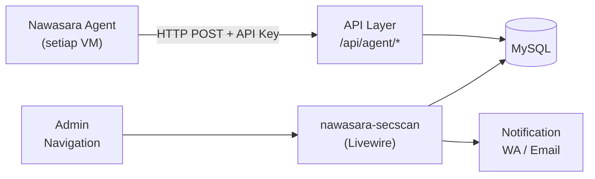

# Nawasara Agent — Dashboard Integration

## Overview

Sisi Dashboard adalah **nawasara-secscan** — package Laravel/Livewire yang
menerima data dari semua agent dan menampilkannya ke admin.



---

## API Endpoints

### Authentication

Setiap request dari agent harus menyertakan header:
```
Authorization: Bearer nwa_xxxxxxxxxxxx
```

API key di-generate saat agent didaftarkan di Dashboard dan terikat ke
satu agent record. Satu agent = satu API key.

---

### 1. Register Agent (sekali saat install)

```
POST /api/agent/register
```

Request:
```json
{
  "hostname": "web-diskominfo-01",
  "os": "ubuntu-22.04",
  "arch": "amd64",
  "agent_version": "1.0.0",
  "web_server": "nginx",
  "ip_local": "10.1.1.50",
  "opd_code": "DISKOMINFO"    ← opsional, kalau admin set saat generate token
}
```

Response:
```json
{
  "agent_id": "agt_01j2k3l4m5",
  "api_key": "nwa_xxxxxxxxxxxx",
  "rules_version": "2026.06.30",
  "plugins": ["nginx", "ssl"]
}
```

---

### 2. Kirim Incident

```
POST /api/agent/incidents
Authorization: Bearer {api_key}
```

Request: lihat format payload di [04-agent-internals.md](04-agent-internals.md)

Response:
```json
{
  "accepted": true,
  "incident_id": "inc_01j2k3server",
  "rules_updated": false
}
```

`rules_updated: true` → agent langsung sync rules baru.

---

### 3. Heartbeat

```
POST /api/agent/heartbeat
Authorization: Bearer {api_key}
```

Request:
```json
{
  "version": "1.0.0",
  "uptime_seconds": 86400,
  "pending_incidents": 0,
  "plugins_active": ["nginx", "ssl"],
  "health_score": 92,
  "metrics": {
    "cpu_percent": 12.5,
    "mem_used_mb": 38,
    "disk_used_percent": 45
  }
}
```

Response:
```json
{
  "ok": true,
  "rules_version": "2026.06.30",
  "rules_updated": false,
  "plugins": ["nginx", "ssl", "docker"],  ← jika ada plugin baru yang di-assign admin
  "commands_pending": 1                    ← Phase 2: ada command menunggu
}
```

---

### 4. Ambil Commands (Phase 2+)

```
GET /api/agent/commands
Authorization: Bearer {api_key}
```

Response:
```json
{
  "commands": [
    {
      "id": "cmd_01j2k3xxxx",
      "action": "block_ip",
      "params": { "ip": "185.220.101.45", "duration": "24h" },
      "requested_by": "admin@ponorogo.go.id",
      "expires_at": "2026-06-30T12:00:00Z"
    }
  ]
}
```

---

### 5. Kirim Hasil Command (Phase 2+)

```
POST /api/agent/commands/{id}/result
Authorization: Bearer {api_key}
```

Request:
```json
{
  "success": true,
  "output": "iptables rule added: -I INPUT -s 185.220.101.45 -j DROP",
  "executed_at": "2026-06-30T10:05:23Z"
}
```

---

### 6. Download Rules

```
GET /api/agent/rules
GET /api/agent/rules/download
Authorization: Bearer {api_key}
```

---

## Nawasara-Secscan Package

### Livewire Pages

```
nawasara-secscan/
└── src/Livewire/
    ├── Dashboard/
    │   └── Index.php           ← overview: health score semua VM, incident summary
    ├── Findings/
    │   └── Index.php           ← tabel semua incident (sudah ada)
    ├── Agents/
    │   ├── Index.php           ← daftar semua agent, status online/offline
    │   └── Show.php            ← detail satu agent: health, plugins, recent incidents
    ├── IpTimeline/
    │   └── Show.php            ← semua incident dari satu IP, timeline view
    └── Rules/
        └── Index.php           ← manage rules (Phase 3+)
```

### Dashboard Overview (Index)

```
┌─────────────────────────────────────────────────────────┐
│  Security Overview                          [Refresh]   │
├─────────────┬─────────────┬─────────────┬──────────────┤
│ Agents      │ Incidents   │ Critical    │ Blocked IPs  │
│ 12 online   │ 47 today    │ 3 aktif     │ 8            │
│ 2 offline   │ ▲ +12       │ ▲ +1        │              │
├─────────────┴─────────────┴─────────────┴──────────────┤
│  Agent Health Status                                    │
│  🟢 web-diskominfo-01    95  nginx, ssl                 │
│  🟢 web-dinkes-01        88  nginx, laravel, ssl        │
│  🟡 web-bpkad-01         71  apache, ssl                │
│  🔴 web-dishub-01        35  nginx  ← last seen 5m ago  │
│  ⚫ web-dinas-01     OFFLINE  ← last seen 3h ago         │
├─────────────────────────────────────────────────────────┤
│  Recent Critical Incidents                              │
│  10:05  web-dinkes-01   SQL Injection    185.x.x.x      │
│  09:58  web-bpkad-01    Exploit Chain   91.x.x.x        │
│  09:31  web-diskominfo  SSH Brute Force 103.x.x.x       │
└─────────────────────────────────────────────────────────┘
```

### Findings Table (Index)

```
┌─────────────────────────────────────────────────────────┐
│  Security Findings            [Filter ▼]  [Export CSV]  │
├──────────┬──────────────┬───────────┬────────┬──────────┤
│ Time     │ VM           │ Type      │ Sev    │ Source IP│
├──────────┼──────────────┼───────────┼────────┼──────────┤
│ 10:05:23 │ web-dinkes   │ SQL Inj.  │ CRIT   │ 185.x... │
│ 10:03:11 │ web-bpkad    │ Vuln Scan │ HIGH   │ 91.x...  │
│ 09:58:44 │ web-bpkad    │ Expl.Chain│ CRIT   │ 91.x...  │
│ 09:31:02 │ web-diskominfo│ SSH Brute│ HIGH   │ 103.x... │
└──────────┴──────────────┴───────────┴────────┴──────────┘

Filter: [Semua VM ▼] [Semua Severity ▼] [Semua Type ▼] [Dari tanggal] [Sampai]
```

### IP Timeline View

```
┌─────────────────────────────────────────────────────────┐
│  IP: 185.220.101.45                    [Block IP] [WhoIs]│
│  Negara: Germany  ASN: AS4134 (Tor Exit Node)           │
├─────────────────────────────────────────────────────────┤
│  Timeline                                               │
│                                                         │
│  10:00:01 GET /.env → 404                               │
│  10:00:02 GET /.git/config → 404                        │
│  10:00:03 GET /wp-admin → 404         ┐                 │
│  10:00:04 POST /login (attempt 1)     │ Correlated      │
│  10:00:05 POST /login (attempt 2)     │ → Exploit Chain │
│  10:00:08 GET /vendor/phpunit/...     │   CRITICAL      │
│  10:00:09 HTTP 500                    ┘                 │
│                                                         │
│  Total requests: 23  |  Incidents: 3  |  VMs: 2        │
└─────────────────────────────────────────────────────────┘
```

---

## Multi-Tenant Isolation

```php
// Agent record terikat ke OPD via nawasara-registry
class Agent extends Model
{
    // agent → opd_id (via nawasara_registry_memberships atau direct)
}

// Semua query di-scope otomatis
class FindingsIndex extends Component
{
    public function getFindings()
    {
        return SecurityIncident::query()
            ->whereHas('agent', fn($q) => $q->where('opd_id', $this->currentOpdId()))
            ->latest()
            ->paginate(25);
    }
}
```

Admin global (Kominfo) bisa lihat semua OPD.
Admin OPD hanya bisa lihat VM milik OPD-nya.

---

## Notifikasi

### Trigger Notifikasi
- Incident severity **Critical** → notif langsung (tanpa delay)
- Incident severity **High** → notif jika > 3 dalam 10 menit dari VM yang sama
- Agent **offline** > 3 menit → notif
- SSL expires < 7 hari → notif harian

### Channel
- WhatsApp (via nawasara-notification)
- Email
- In-app notification (bell icon di topbar)

### Format WA
```
🚨 *INCIDENT KRITIS*

VM: web-dinkes-01
Type: SQL Injection
IP: 185.220.101.45
Waktu: 30 Jun 2026, 10:05 WIB

Evidence:
• GET /api/pasien?id=1 UNION SELECT...
• Status: 500

Lihat detail: https://nawasara.ponorogo.go.id/secscan/findings/inc_xxx
```
